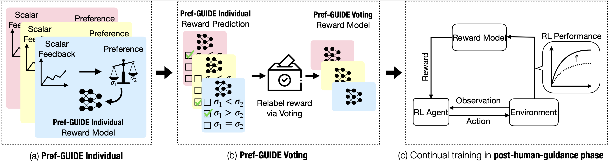
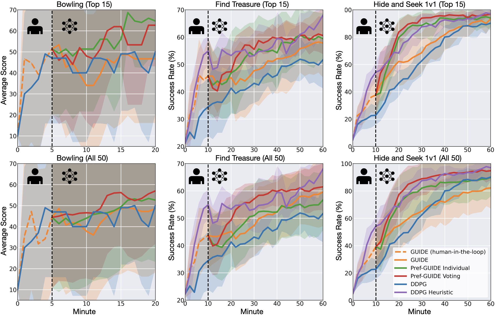

# Pref-GUIDE: Continual Policy Learning from Real-Time Human Feedback via Preference-Based Rewards
[Zhengran Ji](https://jzr01.github.io/)¹, [Boyuan Chen](http://boyuanchen.com/)¹

¹ Duke University

[Website](http://generalroboticslab.com/Pref-GUIDE) | [Paper](https://arxiv.org/abs/2508.07126) | [Video](https://youtu.be/r9Cd7eEdLWE)

## Overview


## Result



## Quick Start

Clone the repository:
```bash
git clone https://github.com/generalroboticslab/Pref-GUIDE.git
```

Install the conda environment, follow the instructions in [CREW](https://generalroboticslab.github.io/crew-docs/)
```bash
conda activate crew
```

Train the preference-based reward model:
```bash
cd reward_model_training
bash train_model.sh
```

Train the RL Agent with the reward model:
```bash
cd CREW/crew-algorithms
bash ddpg.sh
```

Evaluate the trained RL Agent
```bash
bash ddpg_eval.sh
```


## Acknowledgement


This work is supported by the ARL STRONG program under awards W911NF2320182, W911NF2220113, and W911NF2420215, and by gift supports from BMW and OpenAI. We also thank [Lingyu Zhang](https://lingyu98.github.io/) for helpful discussion.


## Citation

If you think this paper is helpful, please consider citing our work

```plaintext
@misc{ji2025prefguidecontinualpolicylearning,
      title={Pref-GUIDE: Continual Policy Learning from Real-Time Human Feedback via Preference-Based Learning}, 
      author={Zhengran Ji and Boyuan Chen},
      year={2025},
      eprint={2508.07126},
      archivePrefix={arXiv},
      primaryClass={cs.LG},
      url={https://arxiv.org/abs/2508.07126}, 
}      
```

