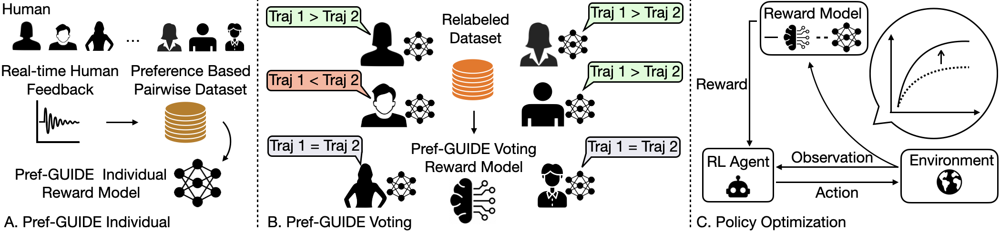

# Pref-GUIDE: Continual Policy Learning from Real-Time Human Feedback via Preference-Based Rewards
[Zhengran Ji](https://jzr01.github.io/)¹, [Boyuan Chen](http://boyuanchen.com/)¹

¹ Duke University

[website](http://generalroboticslab.com/Pref-GUIDE) | [paper](link_here) | [video](video_link)

## Overview


## Result


## Quick Start

Clone the repository:
```bash
git clone https://github.com/generalroboticslab/Pref-GUIDE.git
```

## Acknowledgement


This work is supported by the ARL STRONG program under awards W911NF2320182 and W911NF2220113. We also thank [Lingyu Zhang](https://lingyu98.github.io/) for helpful discussion.


## Citation

If you think this paper is helpful, please consider citing our work

```plaintext
Add Citation here
```

